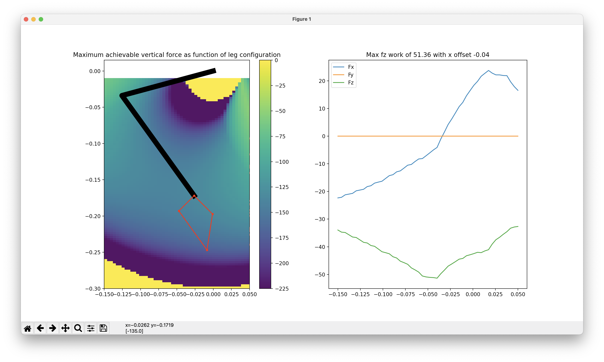

# Installation
```bash
pip3 install git+https://github.com/Nate711/quadruped-lib.git
git clone https://github.com/Nate711/jump-optimization.git
```

# Using
```bash
cd jump-optimization
conda activate jump-opt
python3 optimize.py
```

# Result
Running optimize.py will show an interactive plot like the following.


The left plot shows a serial leg with the foot at the same position as the cursor. The red polygon shows the region of foot forces the leg can achieve in that configuration given friction constraints and maximum torque constraints. The heatmap behind the leg and red polygon shows the maximum vertical force achievable in that configuration. It is clipped at certain bounds to account for compliance / damping in the ground and robot.

The right figure shows the maximum work the robot can do by jumping up vertically from a given position of its foot. From the plot you can see the maximum jumping energy is achieved when the foot starts about 3cm behind the hip joint. The blue line shows the integrated force in the x direction given different starting positions. 